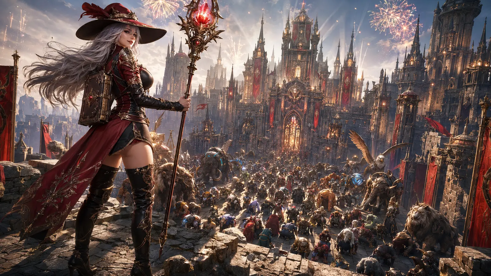

# Rollen und Governance

## Teammodell

| Rolle | Besetzung | Entscheidungskompetenz |
|---|---|---|
| Product Owner, Projektleiter und Architekt | Thomas | Ziele, Priorität, fachliche Abnahme, Veröffentlichung |
| Chief AI Architect & Developer | ChatGPT/Codex | Architekturvorgaben, Sicherheitsreview, Koordination, Endreview |
| Junior AI Developer | lokaler Coding-Agent oder Copilot | begrenzte Implementierung nach Vorgabe, Tests und Dokumentation |
| Junior Admin Runner | einfacher Agent | reproduzierbare Builds, Prüfungen und klar begrenzte Wartungsaufgaben |
| Human Reviewer / QA | Teammitglied | Bedienbarkeit, Spielrealität und Freigabe risikoreicher Änderungen |

## Review-Gates

1. **Scope Gate:** Ziel, Nicht-Ziele und betroffene Quellen sind klar.
2. **Design Gate:** Datenmodell, UX und Rückwärtskompatibilität passen zur Architektur.
3. **Security Gate:** Importdaten bleiben Text; keine Geheimnisse; minimale externe Datenflüsse.
4. **Quality Gate:** Syntax, Runtime-Smoke-Test, Doku-Build und relevante Randfälle sind geprüft.
5. **Human Gate:** Fachliche Zeiten und öffentliche Inhalte sind abgenommen.

Der Chief AI Reviewer darf Änderungen ablehnen, wenn Nachweise fehlen, unnötig große Diffs entstehen oder kanonische Quellen widersprüchlich werden. Die endgültige Produktfreigabe bleibt beim Menschen.

## Arbeitsaufteilung

```text
Thomas                Chief AI                 Junior Agent            CI
  │ Ziel + Priorität      │                         │                    │
  ├──────────────────────▶│ Architektur + Auftrag   │                    │
  │                       ├────────────────────────▶│ Umsetzung          │
  │                       │                         ├───────────────────▶│ Tests
  │                       │◀────────────────────────┤ Diff + Nachweis     │
  │                       │ Review / Korrektur      │                    │
  │◀──────────────────────┤ Freigabeempfehlung      │                    │
  │ fachliche Abnahme     │                         │                    │
```

## Commit- und Changelog-Verantwortung

Jeder Agenten-Commit nennt Was, Warum, Agent, Agentenversion, LLM und LLM-Version. Sichtbare Änderungen aktualisieren zusätzlich den [Changelog](changelog.md); Statusänderungen gehören ins [Taskboard](taskboard.md).

## Microsoft Teams

Teams ist eine mögliche Präsentationsschicht, aber nicht die Quelle der Wahrheit. Nach Verbindung des Teams-Plugins kann das Taskboard als Kanalbeitrag, adaptive Karte oder regelmäßiger Projektstatus gespiegelt werden. Autoritative Daten bleiben im Repository; Tokens und Webhook-URLs gehören ausschließlich in geschützte Secrets.



*Chief Review abgeschlossen: Burg Felswacht erfüllt jetzt knapp die Mindestanforderungen.*
